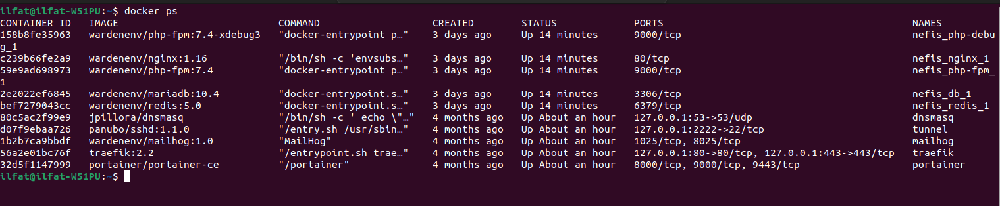
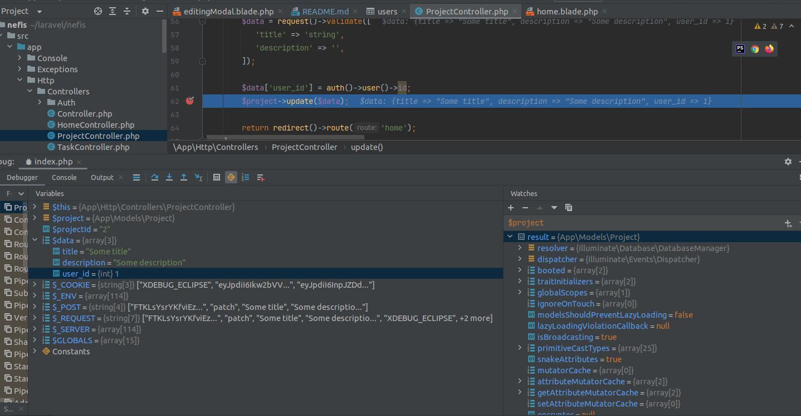

### Инструкция по развертыванию проекта

1. **Клонировать репозиторий:**
   ```bash
   https://github.com/ilfat1508/laravel-todo-list.git
2. **Установить зависимости:**
   ```bash 
   composer install
3. Настроить подключение к базе данных:
   - Откройте файл .env в корне проекта.
   - Настройте параметры подключения к базе данных, такие как DB_HOST, DB_PORT, DB_DATABASE, DB_USERNAME, и DB_PASSWORD.
4. **Выполнить миграции:**
   ```bash
   php artisan migrate
Развертывание в Docker контейнерах с использованием Warden

### Развертывание в Docker контейнерах с использованием Warden

1. **Установить Docker:**
   : Следуйте инструкции по установке Docker:[Установка Docker](https://docs.docker.com/engine/install/)

2. **Установить Warden:**
: Следуйте инструкции по установке Warden: [Установка Warden](https://docs.warden.dev/installing.html)

3. **Инициализировать окружение в директории проекта:**
   ```bash
   warden env-init название_проекта
4. **Выбрать тип окружения:**
: Warden предложит выбрать тип окружения, выберите __laravel.__

5. **Содержимое файла .env:**
 ```
WARDEN_ENV_NAME=nefis
WARDEN_ENV_TYPE=laravel
WARDEN_WEB_ROOT=/src

TRAEFIK_DOMAIN=nefis.localhost
TRAEFIK_SUBDOMAIN=app

MARIADB_VERSION=10.4
NODE_VERSION=18
COMPOSER_VERSION=1
PHP_VERSION=7.4
PHP_XDEBUG_3=1
REDIS_VERSION=5.0

WARDEN_DB=1
WARDEN_REDIS=1

## Laravel Config
APP_URL=http://app.nefis.test
APP_KEY=base64:s24wI7o1MNOnAoEb3v2sic/RtybjJPkKcWj1oA3TAes=

APP_ENV=local
APP_DEBUG=true

DB_CONNECTION=mysql
DB_HOST=db
DB_PORT=3306
DB_DATABASE=laravel
DB_USERNAME=laravel
DB_PASSWORD=laravel

CACHE_DRIVER=redis
SESSION_DRIVER=redis

REDIS_HOST=redis
REDIS_PORT=6379

MAIL_DRIVER=sendmail
```

6. **Поднять docker контейнеры**
   ```bash
   warden env up
   
7. **запускает интерактивную оболочку**
    ```bash
   warden shell
   
### Удобства использования Warden

- Готовое решение для Docker:
: Warden позволяет быстро и легко развернуть окружение, включая изолированный Docker контейнер с базой данных.

- Удобный дебаг PHP кода:
: Можно шаг за шагом проверять код, а также дебажить PHP код, запущенный из консольных команд и контроллеров(отправляя запросы из разны api тестеров такие как postman и talend api tester).

**Чтобы отладить скрипты, запущенные через консоль, выполните следующую команду для запуска интерактивной оболочки:**
  ```bash
  warden debug
```


-Интеграция с Xdebug:
: Warden упрощает настройку Xdebug для дебага PHP кода. Для подробной настройки смотрите [документацию](https://docs.warden.dev/configuration/xdebug.html).
